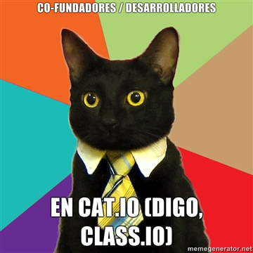

!SLIDE

#Desarrollo web con python+django

!SLIDE bullets

##¿Quiénes son esos tipos?

* Fernando Escher ([@FernandoEscher](http://twitter.com/FernandoEscher))
* Luis Felipe Borjas([@lfborjas](http://twitter.com/lfborjas))

!SLIDE center

!SLIDE bullets

##¿De dónde salieron?

* Class.io: <http://class.io/es/>
* Que es un producto de Escolarea
* Y a veces producen código 
  libre y lo ponen en <https://github.com/escolarea>

    

